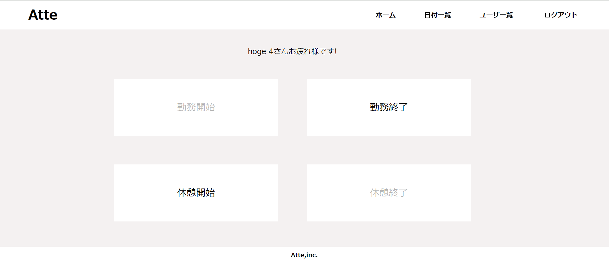
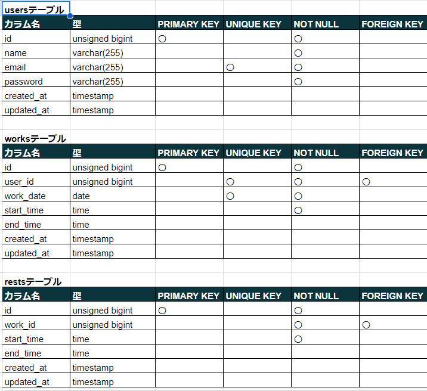
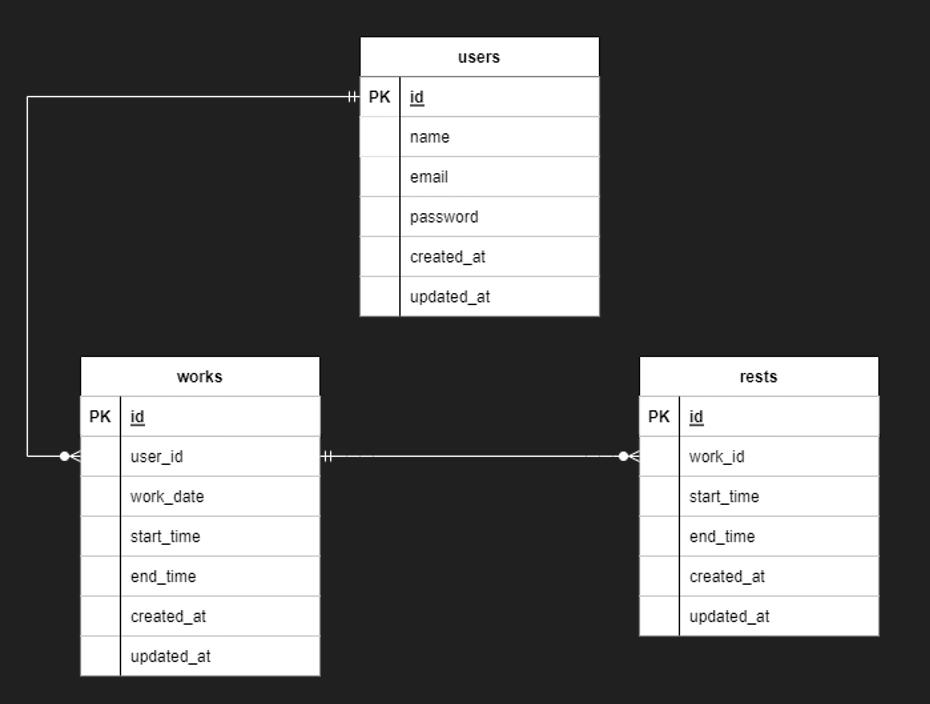

# attendance

勤怠管理システム

概要説明：社員の出勤、退勤、休憩時間の記録を行う。

##作成した目的

概要：人事評価のため勤怠管理システムを導入する

##アプリケーション URL

AWS　CodeCommit

https://git-codecommit.ap-northeast-1.amazonaws.com/v1/repos/attendance

ID:testuser-at-058264478200

PASS:HjIMQM63kzH0KrdHfZOwuDyAKUZ/HrrnL/22JsToTuE=

AWS　（IAMユーザとしてコンソールにサインインする場合は以下を使用してください）

コンソールサインイン：https://058264478200.signin.aws.amazon.com/console

ユーザー名：testuser

コンソールパスワード：testuser1&

パブリック IP アドレス：http://54.248.86.202/

##他のリポジトリ

##機能一覧

会員登録機能（メールによる認証機能あり）

ログイン機能

ログアウト機能

勤務開始/終了打刻機能

休憩開始/終了打刻機能

日付別勤怠情報表示機能

ユーザ一覧表示機能

ユーザ別勤怠情報表示機能

##使用技術（実行環境）

PHP:8.0

Laravel:8.6.12

MySQL:8.0.26

docker-compose:2.23.0

##テーブル設計

##ER 図

##環境構築

Docker ビルド

1.git clone git@github.com:MinaYamamoto/attendance.git

2.docker-compose up -d --build

Laravel 環境構築

1.PHP コンテナ内にログイン
　 docker-compose exec php bash

2.ログイン後、必要なパッケージをインストール
　 composser install

3.「.env.example」ファイルをコピーして「.env」ファイルを作成
　 cp .env.example .env

4.「.env」ファイルの環境変数を変更
DB_HOST=mysql

DB_DATABASE=laravel_db

DB_USERNAME=laravel_user

DB_PASSWORD=laravel_pass

MAIL_MAILER=smtp

MAIL_HOST=mailcatcher

MAIL_FROM_ADDRESS=mailcatcher@example.com

5.アプリケーション起動のためのキーを生成
　 php artisan key:generate

6.マイグレーションを実行
　 php artisan migrate

7.データベースへテスト用の初期データを投入
　 php artisan db:seed

##その他記述
開発環境はローカル、本番環境は AWS を使用しています。

AWS は SSL 認証の設定を行っていません。「http」にてアクセスしてください。

認証メールの確認には MailCatcher を使用しています。

ローカルで認証メールを確認する場合は「http://localhost:1080/」にアクセスしてください。

AWS より認証メールを確認する場合は「http://54.248.86.202:1080/」にアクセスしてください。
